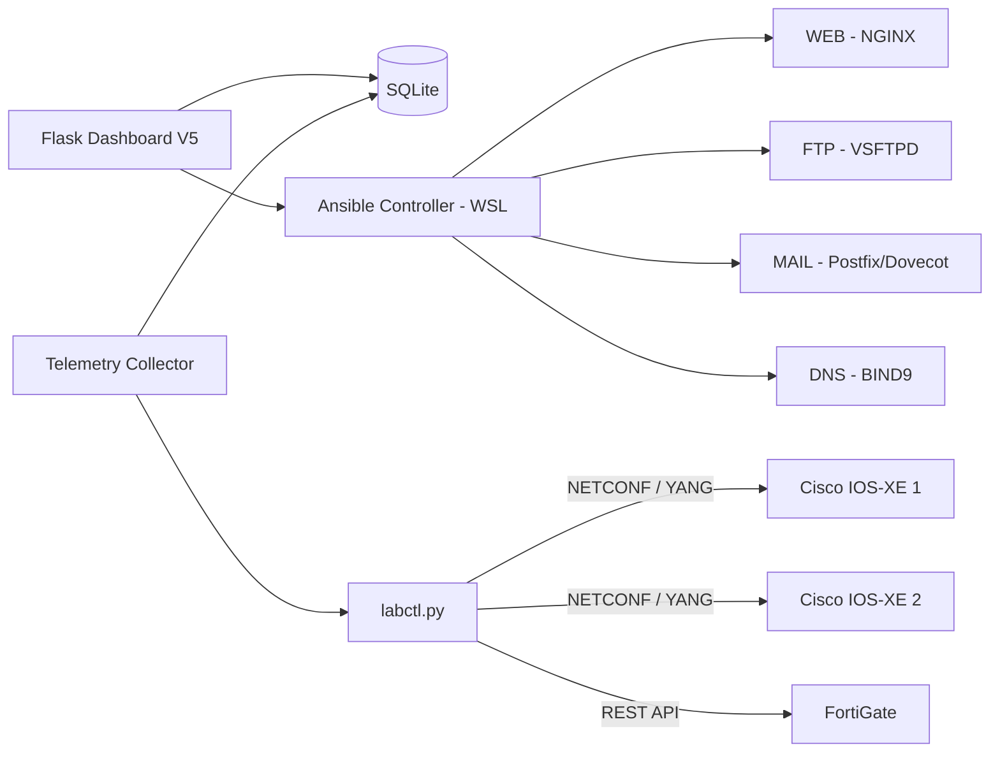

# NetDevOps Control Center

Proyecto integrador de Automatización y Operaciones de Redes NetDevOps.

El sistema integra monitoreo de infraestructura de red, telemetría continua, automatización de servidores Linux, mitigación de incidentes y auditoría desde una interfaz web centralizada.

## Arquitectura



## Funcionalidades

### Cisco IOS-XE

Los switches Cisco son consultados mediante NETCONF utilizando modelos YANG.

El sistema obtiene:

- hostname;
- versión IOS-XE;
- boot time;
- uptime;
- estado administrativo y operacional;
- velocidad de interfaces;
- dirección física;
- contadores RX/TX;
- errores de interfaces.

Modelos utilizados:

- `ietf-interfaces`;
- `ietf-ip`;
- `Cisco-IOS-XE-native`;
- `Cisco-IOS-XE-device-hardware-oper`.

### FortiGate

FortiGate es consultado mediante API REST.

Se obtiene información de:

- hostname;
- modelo;
- versión FortiOS;
- interfaz `wan1`;
- dirección IP;
- estado de enlace;
- velocidad;
- contadores RX/TX;
- errores.

### Telemetría

El collector ejecuta consultas periódicas y almacena los resultados en SQLite.

Fórmula de utilización:

```text
Utilización (%) =
((Delta RX bytes + Delta TX bytes) * 8)
/
(Delta tiempo * velocidad de interfaz en bps)
* 100
```

La telemetría conserva históricos para las interfaces Cisco y `wan1` de FortiGate.

## Automatización Ansible

Se utilizan roles independientes para desplegar cuatro servicios Linux:

| Servidor | Dirección | Servicio |
|---|---|---|
| web01 | 192.168.50.128 | NGINX |
| ftp01 | 192.168.50.131 | VSFTPD |
| mail01 | 192.168.50.130 | Postfix + Dovecot |
| dns01 | 192.168.50.132 | BIND9 |

Los playbooks son idempotentes y pueden ejecutarse varias veces sin producir cambios innecesarios.

El proyecto utiliza un wrapper privilegiado controlado basado en `sudo -n` para la ejecución automatizada.

## Dashboard

La interfaz principal está implementada con Flask.

Incluye:

- Resumen;
- Interfaces;
- Telemetría;
- Alertas;
- Ansible;
- Servidores;
- Mitigación;
- Auditoría.

Desde el dashboard es posible:

- desplegar servicios con Ansible;
- verificar servicios;
- visualizar logs;
- reiniciar servicios autorizados;
- revisar utilización;
- visualizar incidentes;
- simular una condición superior al 70%;
- recuperar una interfaz;
- consultar el historial de acciones.

## Mitigación automática

El sistema supervisa únicamente la interfaz previamente autorizada.

Cuando la utilización supera el 70%, el motor puede registrar un incidente y ejecutar la acción definida para el puerto autorizado.

Por seguridad, el sistema trabaja por defecto en modo:

```text
DRY_RUN
```

En este modo se prueba el flujo de detección, incidente, mitigación lógica, recuperación y auditoría sin modificar físicamente el switch.

La escritura NETCONF real debe habilitarse únicamente durante una prueba autorizada y sobre un puerto específicamente definido para la demostración.

Las acciones quedan registradas junto con:

- timestamp;
- dispositivo;
- interfaz;
- operador autorizado;
- acción;
- resultado.

## Requisitos

### Windows

- Windows 11
- Python 3.13
- Git
- VMware
- WSL2

### WSL

- Ubuntu
- Python 3
- OpenSSH
- Ansible Core 2.20.5

Ejemplo de entorno Ansible:

```bash
python3 -m venv ~/.venvs/netdevops-ansible
source ~/.venvs/netdevops-ansible/bin/activate
python -m pip install ansible-core==2.20.5
```

### Python

El proyecto utiliza principalmente:

- Flask;
- ncclient;
- requests;
- Paramiko;
- Netmiko;
- PyYAML.

## Instalación

Clonar el repositorio:

```powershell
git clone <URL-DEL-REPOSITORIO>
cd netdevops-integrador
```

Crear entorno Python:

```powershell
python -m venv .venv
.\.venv\Scripts\Activate.ps1
```

Instalar dependencias del dashboard:

```powershell
pip install -r .\netdevops_flask_dashboard_v5\requirements.txt
```

Las credenciales no se almacenan en Git.

Los secretos del agente deben almacenarse localmente en:

```text
%USERPROFILE%\.lab-agent\secrets.env
```

Ansible utiliza:

```text
ansible/group_vars/all/vault.yml
```

Este archivo debe permanecer cifrado mediante Ansible Vault y está excluido mediante `.gitignore`.

## Ejecución

### Collector

Desde Windows:

```powershell
cd C:\lab-agent
.\.venv\Scripts\Activate.ps1
python -m netdevops_dashboard_phase3.app.collector
```

### Dashboard

En otra terminal:

```powershell
cd C:\lab-agent
.\.venv\Scripts\Activate.ps1
python .\netdevops_flask_dashboard_v5\app.py
```

Abrir:

```text
http://127.0.0.1:5000
```

### Ansible

Desde WSL:

```bash
cd /mnt/c/lab-agent/ansible
export ANSIBLE_CONFIG=/mnt/c/lab-agent/ansible/ansible.cfg
source ~/.venvs/netdevops-ansible/bin/activate
ansible-playbook site.yml --ask-vault-pass
```

Verificación:

```bash
ansible-playbook verify.yml --ask-vault-pass
```

## Seguridad

El repositorio no debe contener:

```text
secrets.env
vault.yml
*.db
*.sqlite
logs
backups
archivos ZIP generados
```

Las credenciales se almacenan únicamente fuera del repositorio o en Ansible Vault.

Los dispositivos de red se utilizan normalmente en modo de lectura. Las operaciones de escritura se restringen a pruebas autorizadas.

## GitOps

El desarrollo utiliza Feature Branch Workflow.

Ramas implementadas:

```text
feature/baseline-monitoring
feature/ansible-services
feature/monitoring-systeminfo
feature/dashboard-mitigation
feature/documentation
```

Cada característica se integra a `main` mediante Pull Request.

## Estructura principal

```text
netdevops-integrador/
|
|-- ansible/
|   |-- inventory.ini
|   |-- site.yml
|   |-- verify.yml
|   `-- roles/
|
|-- netdevops_dashboard_phase3/
|   `-- app/
|
|-- netdevops_flask_dashboard_v5/
|   |-- app.py
|   |-- index.html
|   |-- ansible_runner.sh
|   |-- server_runner.sh
|   `-- requirements.txt
|
|-- labctl.py
|-- inventory.yaml
|-- requirements.in
`-- README.md
```

## Prueba de presentación

En la red del laboratorio se debe comprobar:

```text
Cisco01 -> NETCONF
Cisco02 -> NETCONF
FortiGate -> REST API
```

Después se inicia el collector y el dashboard.

La mitigación real únicamente debe probarse sobre el puerto de acceso expresamente autorizado para la demostración.

El resto del proyecto puede validarse utilizando las máquinas Linux locales y el modo DRY_RUN.

## Estado del proyecto

- Monitoreo NETCONF/YANG: implementado.
- FortiGate REST: implementado.
- Telemetría continua: implementada.
- Persistencia SQLite: implementada.
- WEB/FTP/MAIL/DNS mediante Ansible: implementado.
- Dashboard Flask: implementado.
- Verificación y logs de servidores: implementado.
- Mitigación DRY_RUN: implementada.
- Recuperación: implementada.
- Auditoría: implementada.
- Mitigación física: reservada para la demostración autorizada.
